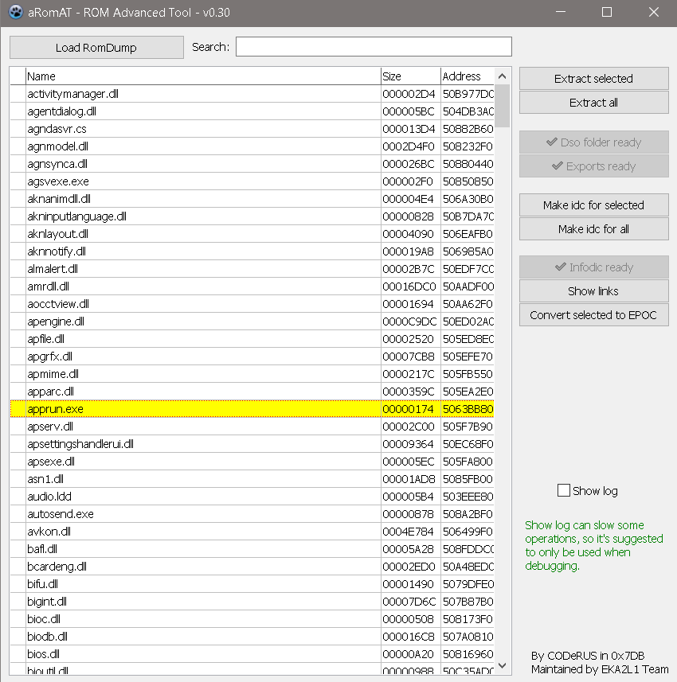

## aRomAT

aRomAT is a tool designed for reversing and extracing of ROM images, allow you to see imports and exports of ROM images
and produces IDC file to assist you reversing them in IDA.

Original work by CodeRUS.

- Features:
   + Extract ROM images.
   + Search for a ROM image through its name or an address which it contains.
   + Output IDC files for IDA to recognise import and export names.
   + Show links and usage of a ROM image to other ROM images.